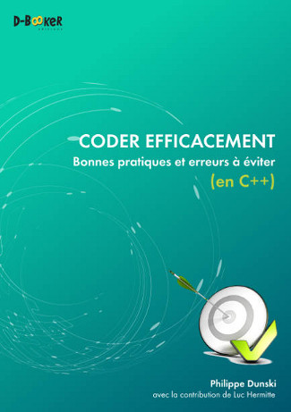

# Coder efficacement
## Bonnes pratiques et erreurs à éviter (en C++)

Ce dépôt contient les codes sources de l'étude de cas du livre [Coder efficacement](http://d-booker.jo.my/coder-efficacement) écrit par Philippe Dunski, paru le 17 février 2014 aux [éditions D-BookeR] (http://www.d-booker.fr).

Veuillez consulter le fichier Info pour savoir comment l'utiliser.

